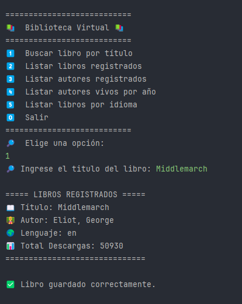
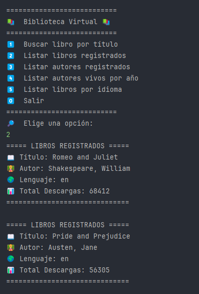
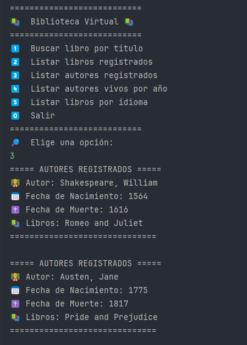
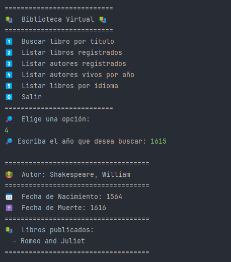
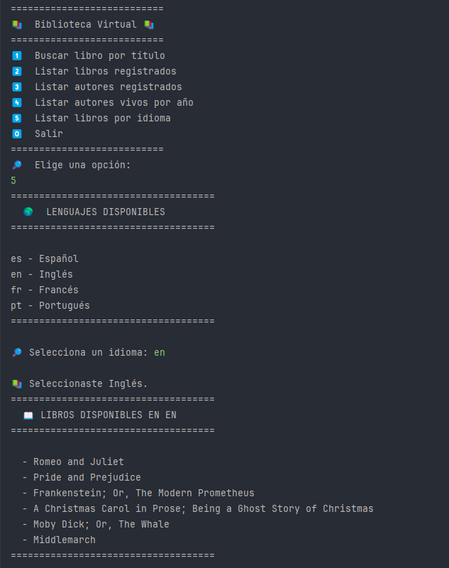

# Proyecto de Gestión de Libros y Autores
### Mi perfil de LinkedIn: [LinkedIn](https://www.linkedin.com/in/cristhianreyesp/)

## Descripción

Este proyecto está diseñado para obtener y gestionar datos de libros y autores utilizando la API de [Gutendex](https://gutendex.com/). La aplicación está construida con **Java 17**, **Spring Boot**, **PostgreSQL**, **Maven**, y utiliza **Jackson-Databind** para interactuar con la base de datos, realizar peticiones a la API de Gutendex, y mostrar los resultados en una consola interactiva.

## Tecnologías utilizadas

- **Java 17**: Lenguaje de programación utilizado para el desarrollo del proyecto.
- **Spring Boot**: Framework para la creación de aplicaciones web en Java.
- **PostgreSQL**: Base de datos relacional utilizada para almacenar información sobre libros y autores.
- **Maven**: Herramienta de gestión de dependencias y construcción del proyecto.
- **Jackson-Databind**: Librería utilizada para convertir objetos Java a formato JSON y viceversa.
- **IntelliJ IDEA**: IDE utilizado para el desarrollo del proyecto.
- **API de Gutendex**: API utilizada para obtener información sobre libros. Más detalles en [Gutendex](https://gutendex.com/).


## Funciones Disponibles

El sistema ofrece una serie de funcionalidades que permiten interactuar con los datos de libros y autores. A continuación se describen las funciones disponibles:

### 1. Buscar Libro

Permite buscar un libro en la base de datos mediante el título.

```java
public void buscarlibro();
```
#### Descripción:
- **Entrada:** El usuario debe ingresar el título del libro.
- **Proceso:** Se consulta la API de Gutendex para obtener los datos del libro.
- Si el libro no está registrado en la base de datos, se crea un nuevo libro y autor (si no existen) y se guarda.
- **Salida:** Muestra un mensaje de éxito si el libro se guarda correctamente o un mensaje de error si ya está registrado.



### 2. Listar Libros Registrados

Permite listar todos los libros que están registrados en la base de datos.
```java
public void listarLibrosregistrados();
```
##### Descripción:
- **Entrada:** No requiere ninguna entrada del usuario.
- **Proceso:** Se obtienen todos los libros registrados en la base de datos.
- **Salida:** Muestra la lista de libros registrados. Si no hay libros, muestra un mensaje indicando que la lista está vacía.



### 3. Listar Autores Registrados
Permite listar todos los autores que están registrados en la base de datos.
 ```java
 public void listarautoresregistrados();
 ```

#### Descripción:
- **Entrada:** No requiere ninguna entrada del usuario.
- **Proceso:** Se obtienen todos los autores registrados en la base de datos.
- **Salida:** Muestra la lista de autores registrados. Si no hay autores, muestra un mensaje indicando que no hay datos registrados.



### 4. Listar Autores Vivos por Año
Permite listar autores que están vivos en un año específico.
 ```java
 private void listarautoresvivos();
 ```

#### Descripción:
- **Entrada:** El usuario debe ingresar un año.
- **Proceso:** Se consultan los autores registrados y se filtran aquellos cuya fecha de muerte es posterior al año ingresado.
- **Salida:** Muestra la lista de autores vivos en el año indicado, junto con los libros que han publicado.



### 5. Listar Autores Vivos por Año
Permite listar libros registrados en un idioma específico.
 ```java
public void listalibroidioma();
 ```

#### Descripción:
- **Entrada:** El usuario debe seleccionar un idioma (por ejemplo, español, inglés, francés o portugués).
- **Proceso:** Se filtran los libros registrados según el idioma seleccionado.
- **Salida:** Muestra la lista de libros disponibles en el idioma elegido. Si no hay libros en ese idioma, muestra un mensaje indicando que no se encontraron libros.



## Instalación

Para instalar y ejecutar este proyecto en tu máquina local, sigue estos pasos:

1. **Clonar el repositorio**:
    ```bash
    git clone https://github.com/cristhianreyesp/challenge-literalura.git
    ```

2. **Configurar PostgreSQL**:
   - Instala PostgreSQL en tu máquina local si aún no lo tienes.
   - Crea una base de datos con el nombre `nombre_db`.

3. **Configurar las credenciales de la base de datos**:
   En el archivo `application.properties` de Spring Boot, configura las credenciales de tu base de datos PostgreSQL:

    ```properties
    spring.datasource.url=jdbc:postgresql://localhost/nombre_db
    spring.datasource.username=tu_usuario
    spring.datasource.password=tu_contraseña
    spring.datasource.driver-class-name=org.postgresql.Driver
    hibernate.dialect=org.hibernate.dialect.HSQLDialect
    ```

4. **Ejecutar el proyecto**:
   Abre el proyecto en IntelliJ IDEA y ejecutalo:

## Programa de Estudio
- [**Alura**](https://www.aluracursos.com/) 
- [**ONE - Oracle Next Education**](https://www.oracle.com/pe/education/oracle-next-education/)